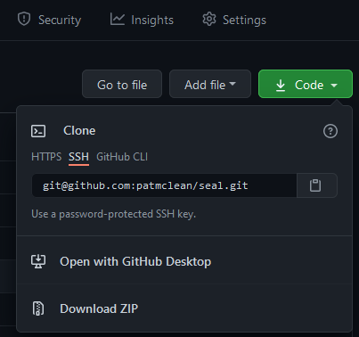

In this example, we will be working with the `pmclean/seal` project.

1. On GitHub, navigate to the main page of the repository in our example it would be the `https://github.com/patmclean/seal` repository.
2. Under the repository name, click green `Code`.


3. To clone the repository, click Use SSH, then click .



4. Open Terminal.
5. In this example, we will create a python filesystem in `~/dev/python/` as this is a python template, and change the current working directory to the location where we want the cloned project reside.

```bash
user@host ~$ mkdir -p ~/dev/python
user@host ~$ cd ~/dev/python
user@host ~/dev/python$ git clone git@github.com:patmclean/seal.git
Cloning into 'seal'...
remote: Enumerating objects: 20, done.
remote: Counting objects: 100% (20/20), done.
remote: Compressing objects: 100% (18/18), done.
remote: Total 20 (delta 0), reused 0 (delta 0), pack-reused 0
Receiving objects: 100% (20/20), 6.04 KiB | 3.02 MiB/s, done.
```

6. Change into the new file system, and validate connectivity back to the seal GitHub repository.

```bash
user@host ~/dev/python$ cd seal
user@host ~/dev/python/seal$ git remote -v
origin  git@github.com:patmclean/seal.git (fetch)
origin  git@github.com:patmclean/seal.git (push)
user@host ~/dev/python/seal$
```

The repository has been cloned and can now see the GitHub Repo as a remote `origin`.  Steps 4, 5, and 6 can be repeated on any computer that has been configured to work with GitHub.
