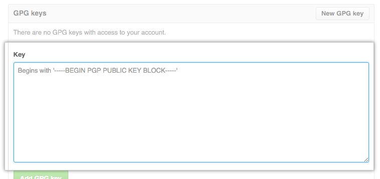

## Installing GPG

Using GPG, you sign tags and commits locally. These tags or commits are marked as verified on GitHub so other people in the Team can trust that the changes come from a trusted source. I suggest commit signing for all code.

## Installation Steps

Open a Ubuntu Terminal. In the terminal run the following.

```bash
devops@devops-pc:~$ gpg --full-generate-key
gpg (GnuPG) 2.2.19; Copyright (C) 2019 Free Software Foundation, Inc.
This is free software: you are free to change and redistribute it.
There is NO WARRANTY, to the extent permitted by law.

Please select what kind of key you want:
   (1) RSA and RSA (default)
   (2) DSA and Elgamal
   (3) DSA (sign only)
   (4) RSA (sign only)
  (14) Existing key from card
Your selection? 1
RSA keys may be between 1024 and 4096 bits long.
What keysize do you want? (3072) 4096
Requested keysize is 4096 bits
Please specify how long the key should be valid.
         0 = key does not expire
      <n>  = key expires in n days
      <n>w = key expires in n weeks
      <n>m = key expires in n months
      <n>y = key expires in n years
Key is valid for? (0) 0
Key does not expire at all
```

If you have made no mistakes, Type Y, press Enter/Return, otherwise type N to restart the process.

```bash
Is this correct? (y/N) y
```

Now, proceed with setting up your credentials for signing. In this example, I am using  _Lab Developer_ and _lab-dev@domain.com_, for demonstration purposes. Use your own name and email.

```bash
GnuPG needs to construct a user ID to identify your key.

Real name: Lab Developer
Email address: lab-dev@domain.com
Comment: enter comment here
You selected this USER-ID:
    "Lab Developer (enter comment here) <lab-dev@domain.com>"

Change (N)ame, (C)omment, (E)mail or (O)kay/(Q)uit?
```

If you have made no mistakes, Type `O`, press Enter/Return, otherwise type `N`, `E`, or `C` to fix the appropriate part of the key, then press O to continue.

After a while, the password dialog box shown will appear, enter a good passphrase twice to protect your key, then click OK to continue.

```bash
    ┌──────────────────────────────────────────────────────┐
    │ Please enter a passphrase                           │
    │ Passphrase: ***********____________________________ │
    │       <OK>                              <Cancel>    │
    └──────────────────────────────────────────────────────┘
```

And to confirm

```bash
    ┌──────────────────────────────────────────────────────┐
    │ Please re-enter this passphrase                     │
    │ Passphrase: ***********____________________________ │
    │       <OK>                              <Cancel>    │
    └──────────────────────────────────────────────────────┘
```

We need to generate a lot of random bytes. It is a good idea to perform some other action (type on the keyboard, move the mouse, utilise the disks) during the prime generation; this gives the random number generator a better chance to gain enough entropy.

```bash
gpg: /home/devops/.gnupg/trustdb.gpg: trustdb created
gpg: key A9E3031D40E7A31F marked as ultimately trusted
gpg: directory '/home/devops/.gnupg/openpgp-revocs.d' created
gpg: revocation certificate stored as '/home/devops/.gnupg/openpgp-revocs.d/71859D719307C206B6936735A9E3031D40E7A31F.rev'
public and secret key created and signed.

pub   rsa4096 2020-07-03 [SC]
     71859D719307C206B6936735A9E3031D40E7A31F
uid                      Lab Developer (enter comment here) lab-dev@domain.com
sub   rsa4096 2020-07-03 [E]

devops@devops-pc:~$
```

The detail of your pubring.kbx should show your newly created key. List your key details as follows.

```bash
devops@devops-pc:~$ gpg --list-secret-keys --keyid-format LONG
/home/devops/.gnupg/pubring.kbx
-------------------------------
sec   rsa4096/A9E3031D40E7A31F 2020-07-03 [SC]
     71859D719307C206B6936735A9E3031D40E7A31F
uid                 [ultimate] Lab Developer (enter comment here) lab-dev@domain.com
ssb   rsa4096/B8239EB7C4286DAB 2020-07-03 [E]
devops@devops-pc:~$
```

The last thing to do is ensure that GPG knows where to execute its signing process. To configure this, run the following in your Ubuntu terminal:

```bash
devops@devops-pc:~$ echo "export GPG_TTY=$(tty)" >> ~/.bashrc
devops@devops-pc:~$ source ~/.bashrc
devops@devops-pc:~$ env | grep GPG
GPG_TTY=/dev/pts/0
devops@devops-pc:~$
GPG is now installed and configured.
```

## Adding your GPG Public Key to Github

In the upper-right corner of any page, click your profile photo, then click Settings.


In the user settings sidebar, click SSH and GPG keys.


Click  **New GPG key**.


In the same terminal that you had open for the creation of your GPG key, again,  type the following to list your gpg keys.  Again for demonstration purposes I am using Lab Developer's here.

```bash
devops@devops-pc:~$ gpg --list-secret-keys --keyid-format LONG
/home/devops/.gnupg/pubring.kbx
-------------------------------
sec   rsa4096/A9E3031D40E7A31F 2020-07-03 [SC]
      71859D719307C206B6936735A9E3031D40E7A31F
uid                 [ultimate] Lab Developer (enter comment here) lab-dev@domain.com
ssb   rsa4096/B8239EB7C4286DAB 2020-07-03 [E]
devops@devops-pc:~$
```

From the list of GPG keys, copy the GPG key ID that corresponds to your  credentials. In this example, the GPG key ID is **A9E3031D40E7A31F** from the line beginning with `sec` above. Now we export the public key associated with your credential, by running the following. In the example here we are using the key listed above. This exports the key in ASCII format to allow for copying to GitHub.

```bash
devops@devops-pc:~$ gpg --armor --export A9E3031D40E7A31F
-----BEGIN PGP PUBLIC KEY BLOCK-----      # Copy this line as well•
mQINBF3/pfYBEADBtsYohFlwuKqFcuekU3CybI3dAY4K/kFfQQHOiSRc/n4KAXc3
WdA3NscYfLjYURfGpS2A91dV5XUkyN7J70w2q7SII4TXndpsEfXBEq0/Iv8Qj6Al
hXofy4XRR2KZBRZdbxqHBrmrxpRVR6meBYOpOVxptxkq64i4nyJVLVRDMXm7isA9
RNIcRBzO5ycuSrNvsh9ZyruLWEIHcWR9maYd6nRjjhTjV8VMbwqay1KmNPQbJbxF
•<!--              snipped text for convenience               -->
•LOu4rLotu1Z8MYqp4ZY89vur1E81vDMULB0I8ejYgwKBbLDqVfWgpy+z5rHTEwoK
8aJ9iLRuVPt0R97akNSyOdbSYjsU36I06KijB+uLBi4mKQ5q4Y08eIfSDSas5YlD
+OLY6oPTvc3WL8U==GdYQ
-----END PGP PUBLIC KEY BLOCK-----       # Copy this line as well
```

Select your key including the **BEGIN/END** lines, as indicated above, and paste the text into the Key field in GitHub

Click the green **Add GPG Key** button.



When prompted, confirm your GitHub password. Your GPG Key has now been added and is ready for use with GitHub.
