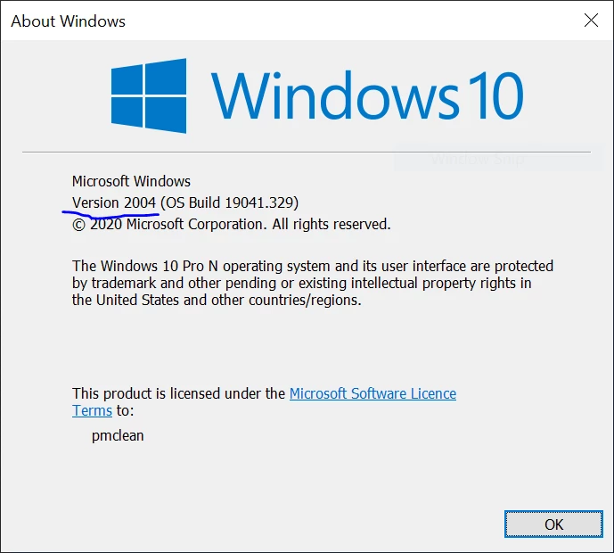
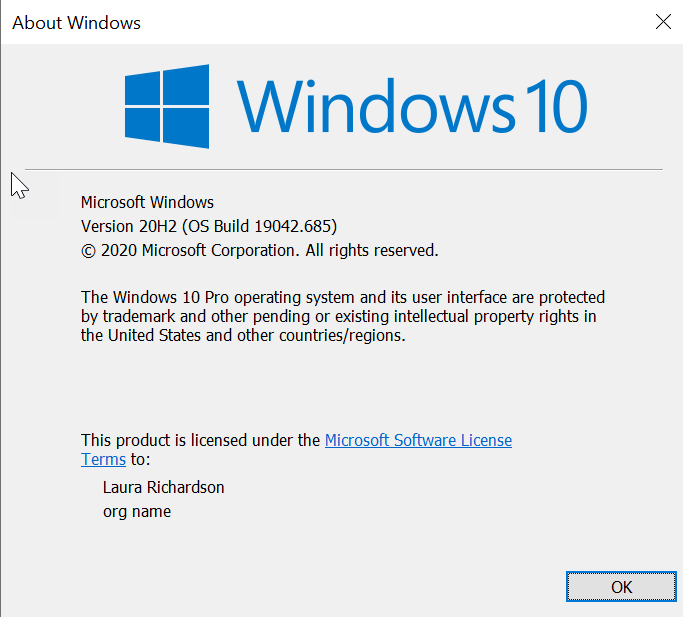
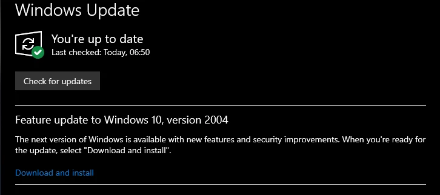

# Prerequisites

Before downloading and installing the software, a couple of tasks must first be completed, to enable seamless integration with target production platforms, version control, and to allow for collaboration cross-platform projects within the DevOps team.

## System Requirements

Windows 10 machines _**must**_ meet the following requirements to install the DevOps Environment:

- Understanding which version you are using is not required, just ensure that you are running either:
  - version 2004 for the consumer edition
  - version 20H2 for the business edition
- Enable the WSL 2 feature on Windows,
- The following hardware prerequisites are required:
  - 64 bit processor with Second Level Address Translation (SLAT)
  - 8GB system RAM
  - BIOS-level hardware virtualization support must be enabled in the BIOS settings.
- Download and install the Linux kernel update package.

## Checking your Windows Version

Check your Windows version by selecting the  **Windows logo key + R** , type winver, select  **OK**. (Or enter the ver command in Windows Command Prompt)

{: style="height:300px;width:300px;align:center;"}

Consumer Edition

{: style="height:300px;width:300px;align:center;"}

Business Edition

If your version is NOT 2004/20H2, please update to the latest Windows via Windows Update, as follows.

Click the Windows Logo then settings:

Then select **Update &amp; Security** , and **Windows Update**.

Apply any outstanding updates that you have rebooting when asked. Eventually you will open the Windows Update panel and see:


If you have a consumer edition of Windows


If you have the business edition of Windows

Click, _Download and install_. The **Windows Update** page will change to something similar to below showing that Windows 10, Version 2004 is installing. Go take a nap at this point (the process to just over an hour and 40 minutes for me), as the update process will rotate thru several status changes, _Getting things ready_, _Downloading_, and _Installing_.


Consumer Edition


Business Edition

After your nap, check and you will see that the update has completed, and that Your system can be rebooted. Press the  **Restart now**  button, and restart.

## Install the Windows Subsystem for Linux

Now we need to enable the &quot;Windows Subsystem for Linux&quot; optional feature, which is used by Docker to host the containers used by VSO.

Open PowerShell as Administrator and run:

```powershell
PS C:\WINDOWS\system32\> dism.exe /online /enable-feature /featurename:Microsoft-Windows-Subsystem-Linux /all /norestart

Deployment Image Servicing and Management tool
Version: 10.0.19041.329
Image Version: 10.0.19041.329
Enabling feature(s)
[==========================100.0%==========================]

The operation completed successfully.
```

### Update to WSL 2

Enable the 'Virtual Machine Platform' optional component

Before installing WSL 2, you must enable the &quot;Virtual Machine Platform&quot; optional feature.

Open PowerShell as Administrator and run:

```powershell
PS C:\WINDOWS\system32\> dism.exe /online /enable-feature /featurename:VirtualMachinePlatform /all /norestart
Deployment Image Servicing and Management tool
Version: 10.0.19041.329
Image Version: 10.0.19041.329

Enabling feature(s)
[==========================100.0%==========================]

The operation completed successfully.
```

Restart your machine to complete the WSL install and update to WSL 2.

```powershell
PS C:\WINDOWS\system32\> restart-computer
```

### Set WSL 2 as your default version

Run the following command in PowerShell as Administrator to set WSL 2 as the default version:

```powershell
PS C:\WINDOWS\system32\> wsl --set-default-version 2
```

You might see this message after running that command:

```powershell
WSL 2 requires an update to its kernel component
```

Please click this [link](https://wslstorestorage.blob.core.windows.net/wslblob/wsl_update_x64.msi) and run the downloaded MSI to install the Linux kernel on your machine for WSL 2 to use.


Once you have the kernel installed, please run the following command again and it should complete successfully without showing the warning message about the kernel component.

```powershell
wsl --set-default-version 2
```
