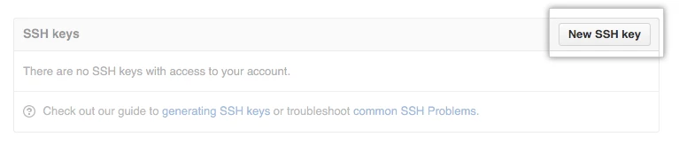
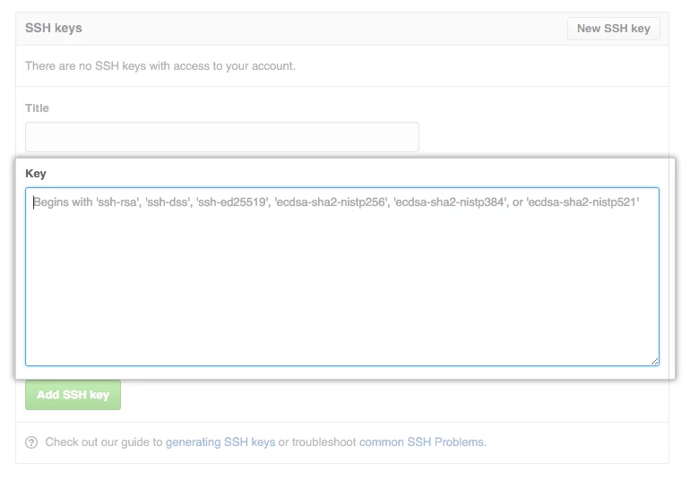

## Configure SSH to authenticate on Ubuntu

Using the SSH protocol, you can connect and authenticate to remote servers and services. With SSH keys, you can connect to GitHub without supplying your username or password at each visit.

This section will show you how to configure SSH on Linux, and add your Key to your GitHub Account.

Click, Start and open a Ubuntu terminal window,  and paste the text below, substituting in your Email Address. This creates a new ssh key, using the provided email as a label. When you're prompted to _Enter a file in which to save the key,_ press Enter. This accepts the default file location.

```bash
you@host:~ $ ssh-keygen -t rsa -b 4096 -C "your_email@domain.com"
Enter a file in which to save the key (/home/you/.ssh/id_rsa): [Press enter]
```

At the password prompt, press enter, or type a secure passphrase, if you use an ssh-agent.

```bash
> Enter passphrase (empty for no passphrase): [Press enter]
> Enter same passphrase again: [Press enter]
Your identification has been saved in id-rsa.
Your public key has been saved in id-rsa.pub.
The key fingerprint is:
SHA256:< A long string of what looks like gibberish > your_email@domain.com
The key's randomart image is:
+---[RSA 4096]----+
|          . =*B +|

A nice lil'graphic

|          . =*B +|
+----[SHA256]-----+

you@host:~ $
```

## Configuring GitHub to use SSH

Log into GitHub.

In the upper-right corner of any page, click your profile photo, then click Settings.


In the user settings sidebar, click SSH and GPG keys.


Then Click **New SSH key** or **Add SSH key**.



In the **Title** field, add a descriptive label for the new key. For example, if you're using the a Dell Laptop, you might call this key _My Dell_.

To copy the SSH public key for addition to GitHub run the following on your OS

In the Ubuntu Terminal on Windows, and at the prompt type the following: `cat ~/.vso/id\_vso.pub`

Copy the resultant output in its entirety, including email address. Do NOT add line-breaks manually.

```bash
devops@devops-pc:~$ cat ~/.ssh/id\_rsa.pub
ssh-rsa
AAAAB3NzaC1yc2EAAAADAQABAAACAQCmwEDEM2rqfqoy25rNJzXfHYcHb1
wHSVUoWRfK6aYfQGYpWyRLBFE5t9DkJiMH5dV+dx6qkCAJhFFu+r2RMVJD
gmkfjAw8I/2U+PPMApJ8RfH+lrVaz2fYkmEetgwWM0UNEJ5IPmMauZahPE
ljlJoKyXTa25Z2KFEJVljd4jnFHr2iuyMgIql3Dt26jZkebgEytaWQTJ9Z
W3NoPXqBd0+kYPyQc8NXj2gTwKwaEFgWAdIu3WPUM/utrtSHp12ePD6UgH
H6siE9xXJUSCgZgZcAVAF2ZTd5y1fa07SvgM8tsV7JavDp62TLw+xpYQhr
htWYpHkIGCaKQHZGKedYnRkjZB9/d0BYflpvLWnjtFanfj3g1RgnNBw2p8
zSl9PwLaQQNsVtGcg60D97TanZIzSD+yWPliZrrIAH8ncOExoGk8s85dWj
pcvxyrKX52kbG5tk51niE/MgQxlRwse9BLFLVlc50BCHn1i27+TJuFHiO+
16uXU1PyN88ZXAT2xgb2uIsxCb4CNBM0L6scwLRj+uLCHCghhdF6zoUvT1
8qtyZsvDu86e0x53ez8zCoX4K/6zYSZQOz+mkSa6DWqCIeeua0EQA/Cw1i
gaCj5X7kKiytLpRT2C1rIb+NP1SEZTyuju+0v2H/kBJPjf6PJJXpByoTU6
gyZfbYLwJrLBAx8PqQ== your_email@domain.com
```

Paste your key into the **_**Key** field.



Click  **Add SSH key**. When prompted, confirm your GitHub password. Your SSH Key has now been added and is ready for use with GitHub
