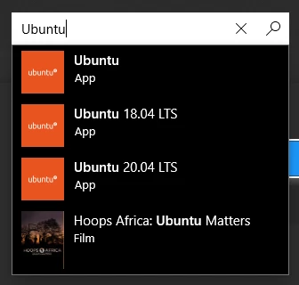
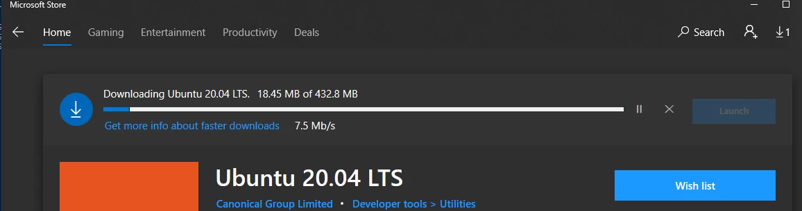
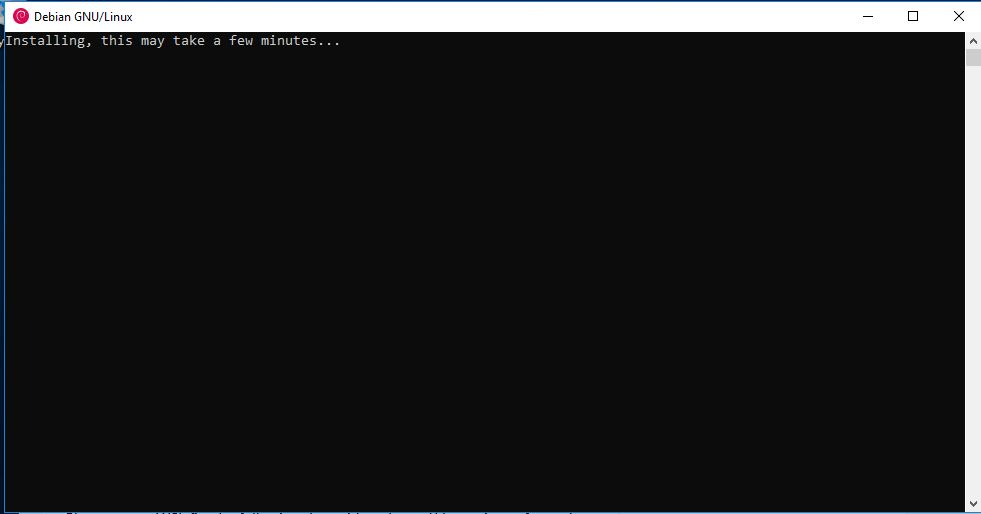
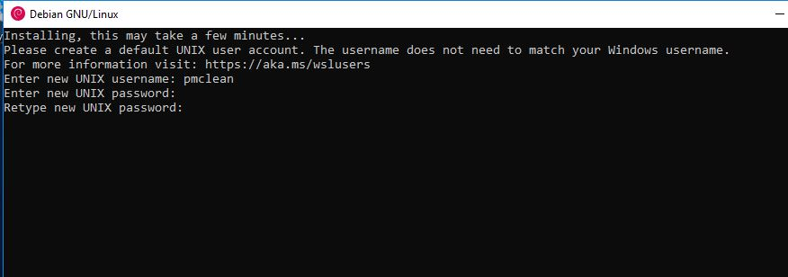
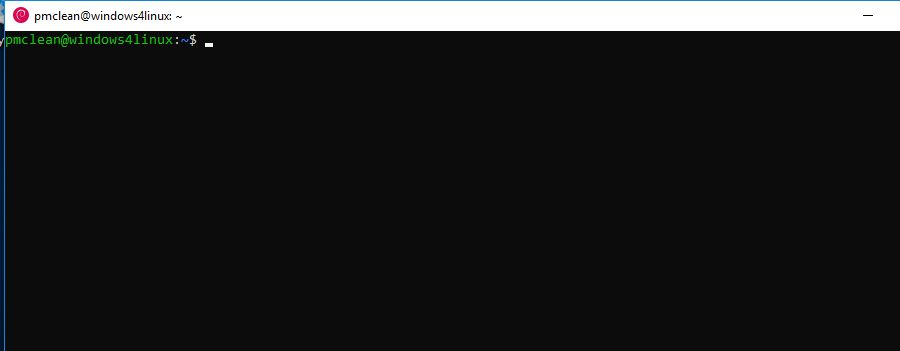
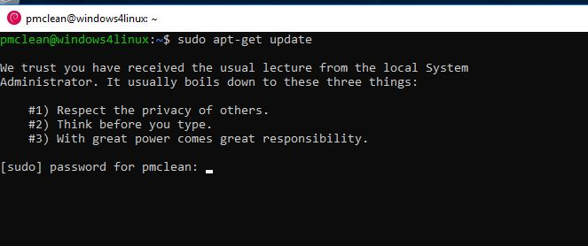
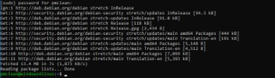
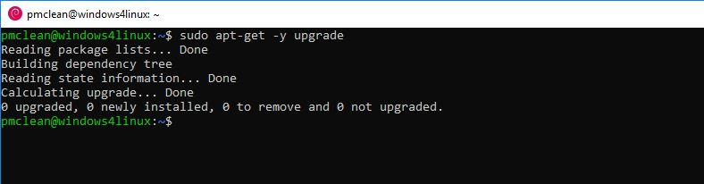

## Install the Ubuntu Linux distribution from Microsoft Store

If you already have Ubuntu installed you can skip to [Set your distribution version to WSL 2](#set-your-distribution-version-to-wsl-2). Open the Microsoft Store and search for Ubuntu 20.04. (CentOS is available, but it is not free AND is managed by a team in China, NOT the CentOS group). Ubuntu is managed by Canonical.



Once chosen, click on get and install. If asked to enter your Microsoft ID, you can say 'No, thanks', Ubuntu will start downloading.



Once downloaded, click  **Launch** , a new window will open.

## Configuring Ubuntu when first used

When first launched Ubuntu will start some configuration.



Ubuntu is now running some initial startup programs to prepare the Ubuntu environment for use.



When prompted, enter a username (it is recommended for simplicity that current user ID be used. in this example, 'pmclean' is used)



Ubuntu is now configured and ready for use!

##  Configuring package repositories

To be able to maintain and allow for future enhancements, the Ubuntu installation needs to be configured for updates, and then brought up to date. The first step in preparing update, is to refresh the package repositories in the Ubuntu instance. To update the software repositories, at the command prompt

```bash
sudo apt-get update
```


Enter the `sudo` password . This will be the password that was entered for the account on first run, and will be used going forward to execute ALL `sudo` command.



Ubuntu will now update the local repository cache with the latest build information

Now, upgrade Ubuntu to use the latest version of all installed packages.

```bash
sudo apt-get -y upgrade
```



In this example, all packages were up to date, so no packages were updated

Type exit and then ``enter/return`` to close the window.

## Set your distribution version to WSL 2

You can check the WSL version assigned to each of the Linux distributions you have installed by opening the PowerShell command line and entering the command (only available in Windows Build 19041 or higher): wsl -l -v

If you are running the un-numbered version of Ubuntu you will see

```powershell
PS C:\Users\devops-pc\> wsl -l -v
 NAME               STATE          VERSION
 Ubuntu             Running         2
PS C:\Users\devops-pc\>
```

For Ubuntu 18.04

```powershell
PS C:\Users\devops-pc\> wsl -l -v
 NAME               STATE          VERSION
 Ubuntu-18.04       Running         2
PS C:\Users\devops-pc\>
```

For Ubuntu 20.04

```powershell
PS C:\Users\devops-pc\> wsl -l -v
 NAME               STATE          VERSION
 Ubuntu-20.04       Running         2
PS C:\Users\devops-pc\>
```

If your Version shows up as `1`, set the distribution to be backed by `WSL2`, so please run:

```powershell
PS C:\Users\devops-pc\> wsl --set-version Ubuntu 2       # If you have the Ubuntu un-numbered
PS C:\Users\devops-pc\> wsl --set-version Ubuntu-18.04 2 # If you have the Ubuntu 18.04
PS C:\Users\devops-pc\> wsl --set-version Ubuntu-20.04 2 # If you have the Ubuntu 20.04
Conversion in progress, this may take a few minutes...
For information on key differences with WSL 2 please visit https://aka.ms/wsl2
Conversion complete.
PS C:\Users\devops-pc\> wsl -l -v
 NAME               STATE          VERSION
 Ubuntu-20.04       Running         2
PS C:\Users\devops-pc\>
```
