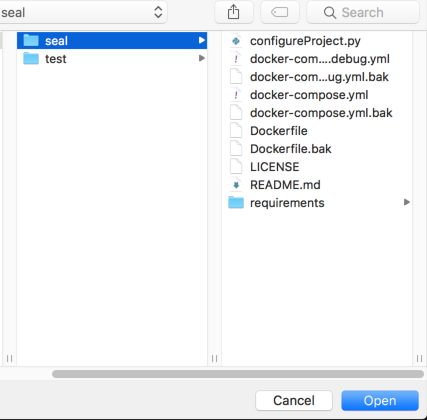
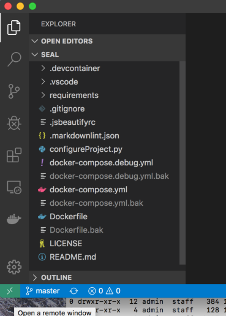
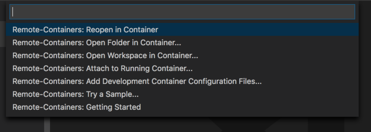

In this example, we are working with the `seal` example project.

## Opening the project in Visual Studio Code

Open Visual Studio Code (VSC), click File -> Open, navigate to the folder containing the new project, in our case here, `seal`. Click **Open**.



The project will load in VSC.



Once loaded, click on the small green Icon on the bottom left hand corner of the editor. 

This will make the remote select dropdown appear.



Chose **Remote-Containers: Reopen in Container**.

The project will now open in a docker container.


As this is the first time we are opening this container, it will take a while to open, as the required images need to be downloaded from teh docker image hub, to build the container. I suggest a coffee.

The container will be fully loaded and ready to use when the icon in the bottom left switches from **Opening Remote** to **Dev Container:seal** as shown.


We can now test that the container is up and running by opening a terminal within VSC.  `CTRL+backtick` open the new terminal.

The command prompt of the new terminal will read:

``` bash
vscode@seal:/app$
```

## Testing SSH and GPG within your container

To connect to GitHub from within Visual Studio Code, open the Integrated Terminal.  At the command prompt type the following:

```bash
vscode@seal:/app$ env | grep GPG
GPG_TTY=/dev/pts/0
GPG_KEY=0D96DF4D4110E5C43FBFB17F2D347EA6AA65421D
vscode@seal:/app$ git pull
Already up-to-date.
vscode@seal:/app$ echo git | gpg --clearsign
```

If all is well, you will receive an output simmilar to the above. and be propmeted for your GPG password.

```bash
    ┌────────────────────────────────────────────────────────────────┐
    │ Please enter the passphrase to unlock the OpenPGP secret key: │
    │ "Lab Developer <lab-dev@domain.com>"                          │
    │ 2048-bit RSA key, ID <GPG KEY HERE>,                          │
    │ created 2021-05-20.                                           │
    │                                                               │
    │                                                               │
    │ Passphrase: _________________________________________________ │
    │                                                               │
    │         <OK>                                    <Cancel>      │
    └────────────────────────────────────────────────────────────────┘
```

Enter your password and GPG will clearsign.

```bash
gpg: all values passed to '--default-key' ignored
-----BEGIN PGP SIGNED MESSAGE-----
Hash: SHA256

git
-----BEGIN PGP SIGNATURE-----

iQEzBAEBCAAdFiEEgAW66/BDmau3P7xdtPEphdY4DH4FAl36EIgACgkQtPEphdY4
DH6YNwf9FdCbTNxImoCFtsQLsZQd7ewLxorRmBmr0CDjp9tb4BrBDxPBr16tmONK
q8B4v28rUuB489y0E0+dfRa1ZUa2P2dvNzfprW97L4BFzTgd78GTBxKr4L8FPEbt
4p8Aj53SXH5NT+IyFkTdS7Y/OErqZRcNQspRn2mGEyrBWJ0Gy6DPRCPYQolqiigb
e21tCvGRS73+Ub/NOblJF4KkEmXtMwFt7M+MWC5OcNIuzy4Rxr/0vy7K6rrNGX7B
/pDHFhQss9GocG9wpEnjV6se7pX06ENzJDUDMNMME4+cfiXokiyod+q4jv9v5Lpp
lytT5WFdxSpl5DyIB1D9pP6RZsWtwQ==
=9FfA
-----END PGP SIGNATURE-----
vscode@seal:/app$
```

Congratulations, the Container is now configured and ready to use for your application.
