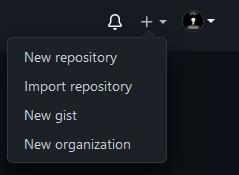
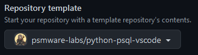
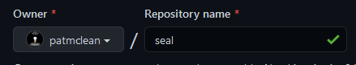
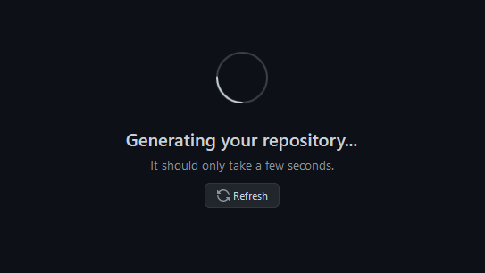

You can create a new repository on your personal account or in the organization from this template.  In this example, we are goin to create a new repository from the new template.  Whilst you can choose to make the repository either public or private, public repositories are visible to the public, while private repositories are only accessible to you, and people you share them with; I make any work related repositories private.

1. In the upper-right corner of any page, use the **+** drop-down menu, and select **New repository**.

2. Use the **Choose a template** drop-down and select the `domain/vso.python` template repository.

3. Select, `domain` as the owner, and name the repository, in this example we are using `seal` as the repo name.

4. We have added a brief description and then chose **Private**, if it is not already marks as such.

5. Click on **Create Repository**

6. The repository will start generating.

7. The repository has been created. And as can be seen, has been created from the template.

