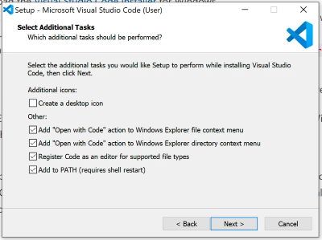
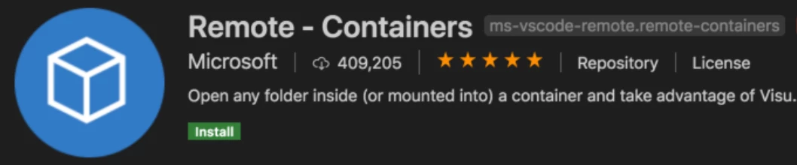
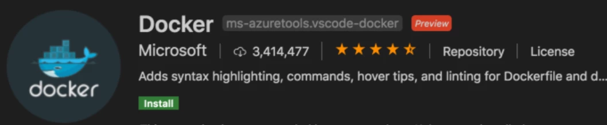

Visual Studio Code is a lightweight but powerful source code editor which runs on your desktop and is available for Windows, macOS and Linux. It comes with built-in support for JavaScript, TypeScript and Node.js and has a rich ecosystem of extensions for other languages (such as C++, C#, Java, Python, PHP, Go) and runtimes (such as .NET and Unity).

It also integrates seamlessly with Docker to allow for developing inside Docker containers. &quot;So what, Pat?&quot; I hear you say? Well, how about having your entire development environment and source all stored as code. This gives a consistent development environment for an entire team. All developers use the same OS for development, the same system libraries, and the same language runtime, no matter what host OS they are using.

## Installation

Download the System Installer for windows from the [Visual Studio Code Download page](https://code.visualstudio.com/download)

Accept the licence agreement, and click **Next** until you get to the **Select Additional Task** window.

Ensure that the bottom 4 check boxes are **ticked** , then click **Next**. Installation will start, and complete.

Launch **Visual Studio Code.**

## Installing the Docker Development Extensions

With Visual Studio Code open, click on the '4-cube' icon to open the extensions sidebar.

Type remote into the search box at the top, then click **Remote - Container**. Ensure that the extension is the 'Remote-Containers' Extension as owned by Microsoft, seen from the screenshot.

Click the Green  **Install**  Button.

Type docker into the search box at the top, then click **Docker**. Ensure that the extension is the 'Docker' Extension as owned by Microsoft, seen from the screenshot.

Click the Green  **Install**  Button.

Visual Studio Code is now configured, and can now be closed.
